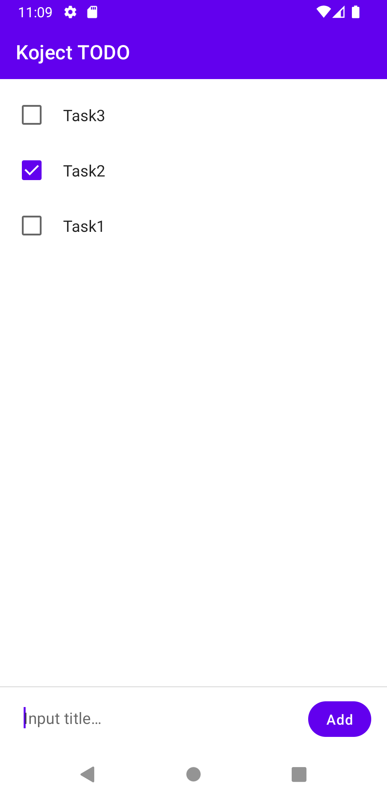
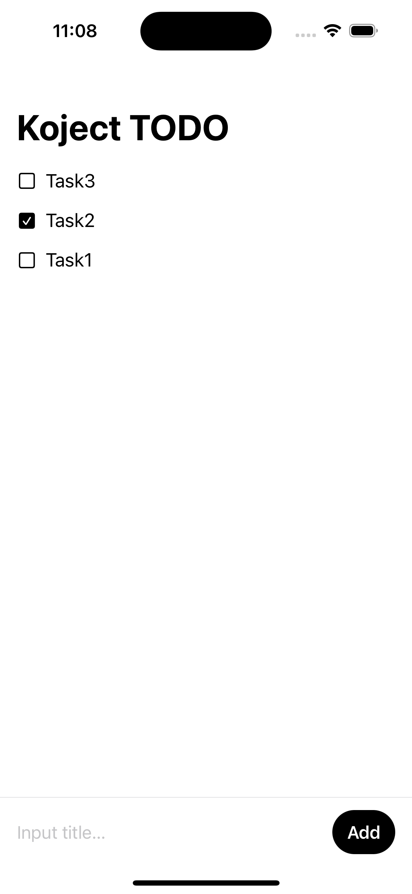

# Koject TODO
This is an example TODO application using [KMM(Kotlin Multiplatform Mobile)](https://kotlinlang.org/lp/mobile/) to demonstrate how to use Koject.

android|iOS
:--:|:--:
|

## Other Libraries
* [Jetpack Compose](https://developer.android.com/jetpack/compose) (Android UI)
* [SwiftUI](https://developer.apple.com/xcode/swiftui/) (iOS UI)
* [SQLDelight](https://github.com/cashapp/sqldelight) (Database)
